# Hi 👋, I'm Nirmana Ekanayaka

### Computer Engineer | Cloud & DevOps Enthusiast | Software Developer

📍 Sri Lanka

  
  
  

---

## 👨‍💻 About Me

I'm a **Computer Engineering graduate from Sri Lanka** with a strong interest in **Cloud Computing, DevOps, Software Engineering, and Infrastructure**.

I enjoy building practical systems, learning how applications move from development to deployment, and improving my knowledge of cloud infrastructure, automation, networking, and modern software engineering.

- ☁️ **AWS Certified Cloud Practitioner**
- 🚀 Working toward a career in **DevOps / Cloud Engineering**
- 🐧 Interested in **Linux, networking, cloud infrastructure, CI/CD, and automation**
- 💻 Experience with **React, TypeScript, Node.js, NestJS, PostgreSQL, and Docker**
- 🛠️ I enjoy learning through real-world, hands-on projects
- 📫 **nirmanaekanayaka@gmail.com**

---

## 🚀 Featured Projects

### 🌾 Paddy Trading Management System

A full-stack business management system designed to digitize and streamline real-world paddy trading operations.

The system covers areas including farmer management, dispatches, weight recording, advances, settlements, payments, labour management, and operational workflows.

Designed with a strong focus on **role-based access control, data integrity, auditability, security, and maintainable architecture**.

**Tech Stack**

`React` `TypeScript` `NestJS` `PostgreSQL` `TypeORM` `Docker`

> 🔒 Private Repository

---

### 🐘 Kumana Safari Website

A modern, responsive tourism website designed for a safari jeep driver operating around **Kumana National Park, Sri Lanka**.

The website focuses on presenting safari experiences, wildlife, the driver, reviews, gallery content, and easy **WhatsApp-based booking** through a mobile-friendly experience.

**Tech Stack**

`React` `TypeScript` `Vite` `Tailwind CSS`

---

### ☁️ Highly Available 3-Tier AWS Architecture

A production-style, highly available AWS architecture built from scratch to demonstrate core cloud infrastructure and networking concepts.

**Key Areas**

`AWS` `VPC` `EC2` `Auto Scaling` `Application Load Balancer` `Multi-AZ` `RDS` `Networking`

---

## ☁️ Cloud & DevOps

  

---

## 💻 Development

  

---

## 🗄️ Databases & Tools

  

---

## 🎓 Certifications

### ☁️ AWS Certified Cloud Practitioner

**Knowledge Areas:** Cloud Concepts • AWS Services • Security • Architecture • Billing & Pricing

---

## 📊 GitHub Statistics

---

## 🌱 Currently Learning

`AWS` `DevOps` `CI/CD` `Docker` `Linux` `Networking` `Automation`

---

## 🤝 Let's Connect

I'm interested in opportunities where I can continue learning and contribute to **Cloud, DevOps, Infrastructure, and Software Engineering** projects.

Feel free to connect with me on **LinkedIn** or reach out by **email**.

### Thanks for visiting my profile! 🚀

